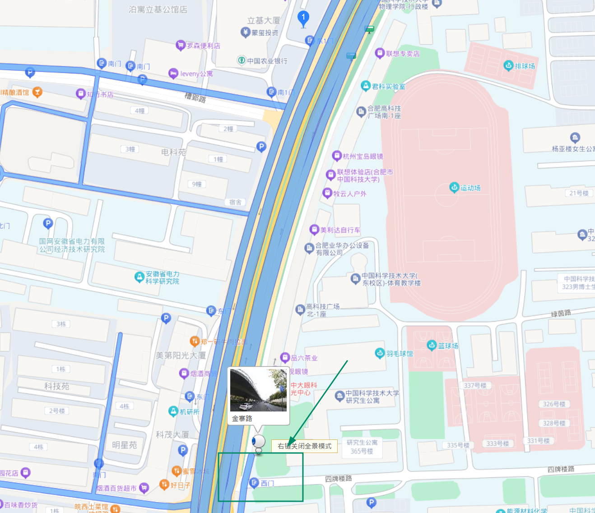
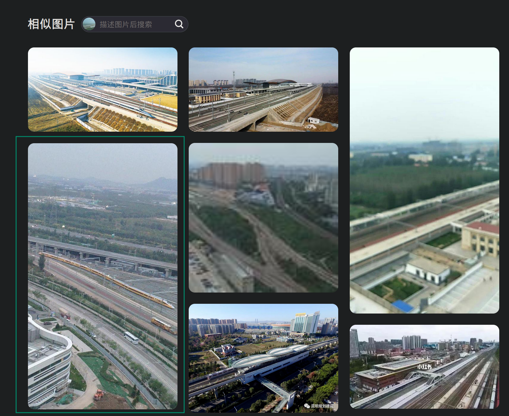

# 旅行照片 4.0

## 题目 1-2

### Q1

> 问题 1: 照片拍摄的位置距离中科大的哪个校门更近？（格式：X校区Y门，均为一个汉字）

百度地图搜索「科里科气科创驿站」，得到「中国蜀山科里科气科创驿站（科大站）」。

最近的两个门不是校门，往南走有东校区的西门，小小的。

答案：`东校区西门`

### Q2

> 问题 2: 话说 Leo 酱上次出现在桁架上是……科大今年的 ACG 音乐会？活动日期我没记错的话是？（格式：YYYYMMDD）

Bilibili 搜索「中科大 ACG 音乐会」，可以找到帐号「中科大LEO动漫协会」，他们有个视频合集：[2024ACG音乐会](https://space.bilibili.com/7021308/channel/collectiondetail?sid=3077731)。

视频简介可以找到「2024年5月19日 中国科大 第三届 ACG音乐会」。

答案：`20240519`

比赛时当作背景音在旁边放着听，科大的活动氛围真好。

## 题目 3-4

### Q3

> 问题 3: 这个公园的名称是什么？（不需要填写公园所在市区等信息）

图片右下角垃圾桶找到地点「六安」。

搜索「六安 公园 彩虹跑道」找到文章：[彩虹跑道、灯光喷泉！六安城区这两所公园又变美了](https://www.sohu.com/a/498872898_100023473)。

答案：`中央公园` 或 `中央森林公园`

我只用到了搜索引擎，没用任何 APP，甚至不是国内搜索引擎。可能，~~狗运~~关键词猜得好胜过一切吧。

### Q4

> 问题 4: 这个景观所在的景点的名字是？（三个汉字）

百度识图得到三峡大坝，搜索「三峡大坝 喷泉」得到「截流四面体纪念石」，进而得到景点。

国内地点，还是可能还是百度好用……

答案：`坛子岭`

## 题目 5-6

### Q5

百度识图能发现一个图片中房子非常类似拍摄位置近处建筑，只不过是另一个角度：

它来自 Bilibili 的一个视频：[和谐号黄医生动检车驶出动车所，进入京张高铁正线运行](https://www.bilibili.com/video/BV15J411R72H)

视频简介能够得到此处是「北京北动车所」，在地图中翻到最近的医院是「北京积水潭医院」

答案：`积水潭医院`

### Q6

> 问题 6: 左下角的动车组型号是？

搜索 「"四编组动车" "北京" 北动车所」，得到网页：[https://www.china-emu.cn/Trains/Model/detail-26012-201-F.html](https://www.china-emu.cn/Trains/Model/detail-26012-201-F.html)

答案：`CRH6F-A`

## 碎碎念

不喜欢做国内地点，百度搜索和百度地图用着很难受，至今没搞明白怎么在某处搜索附近的建筑物。

而且国内地点很可能突然有人蹦出来告诉你：「嘿，我 XXX APP 随手一搜就出来了」。

多新鲜啊 —— Q5-6 题目文案。
