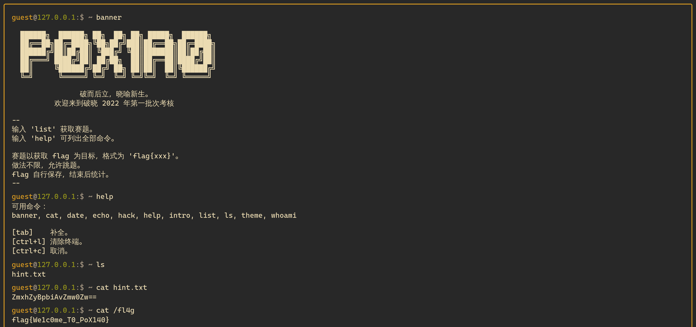
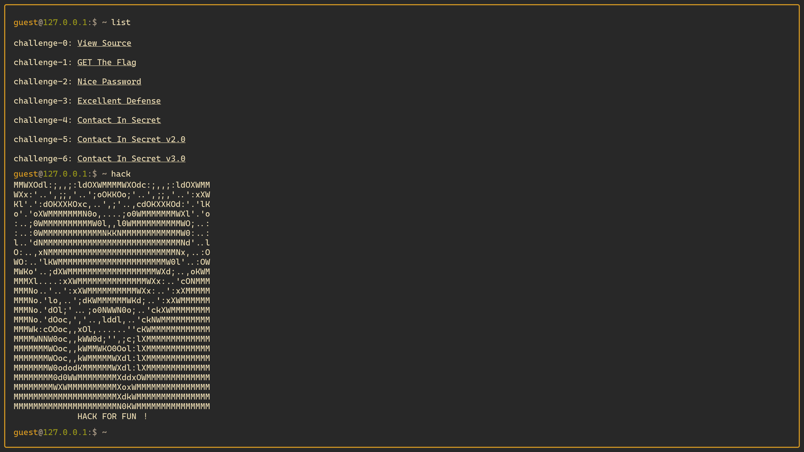

# 喜欢做签到的 CTFer 你们好呀

「藏在中国科学技术大学校内 CTF 战队的招新主页」，我是先是用「USTC」作关键字搜到了 CTF Time 上的战队主页，然后才找到主页地址。

- [https://ctftime.org/team/168863/](https://ctftime.org/team/168863/)
- [https://www.nebuu.la/](https://www.nebuu.la/)

结果比赛主页的承办单位居然就有，眼神不太好使……

网站打开是一个终端，可以输入一些命令。

需要注意的是所有命令都是预设好的效果，能不能和终端命令行下产生同样效果，要看代码如何写。比如 `ls` 其实没法列出指定文件夹内容。

第一个 Flag 在 `env` 命令结果中，这个命令可以列出环境变量：

```
ctfer@ustc-nebula:$ ~ env
PWD=/root/Nebula-Homepage
ARCH=loong-arch
NAME=Nebula-Dedicated-High-Performance-Workstation
OS=NixOS❄️
FLAG=flag{actually_theres_another_flag_here_trY_to_f1nD_1t_y0urself___join_us_ustc_nebula}
REQUIREMENTS=1. you must come from USTC; 2. you must be interested in security!
```

第二个 Flag 在隐藏文件 `.flag` 中：

```
ctfer@ustc-nebula:$ ~ ls -la
.flag
.oh-you-found-it/
Awards
Members
Welcome-to-USTC-Nebula-s-Homepage/
and-We-are-Waiting-for-U/

ctfer@ustc-nebula:$ ~ cat .flag
flag{0k_175_a_h1dd3n_s3c3rt_f14g___please_join_us_ustc_nebula_anD_two_maJor_requirements_aRe_shown_somewhere_else}
```

## 其他

终端很熟悉，用的是 [m4tt72/terminal](https://github.com/m4tt72/terminal)，前两年我也把它用在工作室招新考核主页了。

这个终端不好复制的问题依然在，要么选中时不松手 CTRL+C，要么审查元素。




死去的回忆开始攻击我。

~~继[原神，启动！](https://github.com/SVUCTF/SVUCTF-HELLOWORLD-2023/blob/main/challenges/web/non_pressable_button/README.md)以来，又一 HG 抄袭我们野鸡比赛的力证。~~

心脏滴血的 ASCII Art 真好看。
